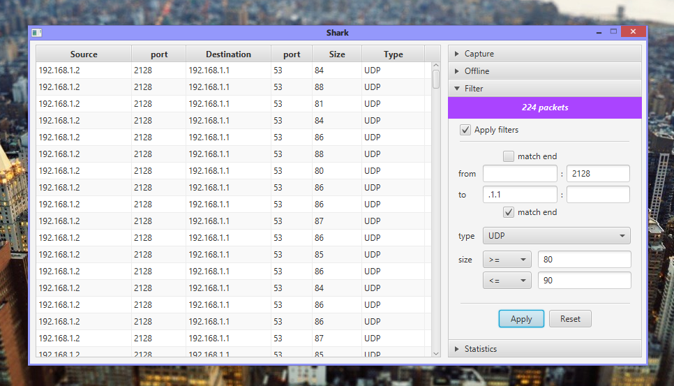

Shark
=====

Packet capturing, analyzing and extraction of security related data in Java.
(Not a fork of the deprecated *SharkHunt* project)

Developer working environment: IntelliJ IDEA (community), jNetPcap, JavaFX, Windows 8.1

Prerequisites: [WinPcap(libpcap)](https://www.winpcap.org/install/)

### (planned) development milestones or **features**

- [x] read pcap/cap packet captures from disk
- [x] extract packet details to memory and store in-memory
- [x] filter packets dynamically and efficiently
- [x] JavaFX GUI
- [x] live capturing
- [x] GUI for filtering
- [ ] documentation (general user)
- [ ] documentation (developer)
- [ ] optimization
- [ ] plug-in system

Project Shark was developed as a research-oriented solution. While it does not aim to be a
replacement or alternative to the very popular and more advanced WireShark, we belive there
is a place for a security-specific application with extensibility for specific usages.

Founding developers: [ Nirmal Lankathilaka ](https://github.com/NirmalL "Nirmal's GitHub"), [ Narmadaa Baalasooriya ](https://github.com/NarmadaBalasooriya "Narmada's GitHub"), [ Madusha Jayawardhana ](https://github.com/madushaj "Madusha's GitHub")
