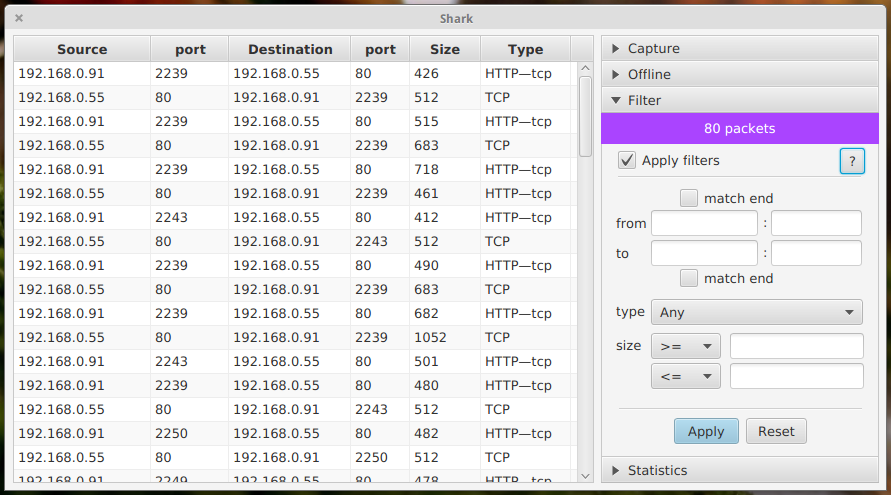

Shark
=====

Packet capturing, analyzing and extraction of security related data in Java.
(Not a fork of the deprecated *SharkHunt* project)

Developer working environment: IntelliJ IDEA (community), jNetPcap, JavaFX, Windows 8.1

Prerequisites: [WinPcap(libpcap)](https://www.winpcap.org/install/)

Read [Developer Milestones & Goals](https://github.com/NirmalL/Shark/wiki/Goals)

Project Shark was developed as a research-oriented solution. While it does not aim to be a
replacement or alternative to the very popular and more advanced WireShark, we belive there
is a place for a security-specific application with extensibility for specific usages. (Read our [philosophy](https://github.com/NirmalL/Shark/wiki#philosophy))

Founding developers: [ Nirmal ](https://github.com/NirmalL "Nirmal's GitHub"), [ Narmadaa ](https://github.com/NarmadaBalasooriya "Narmada's GitHub"), [ Madusha ](https://github.com/madushaj "Madusha's GitHub")
